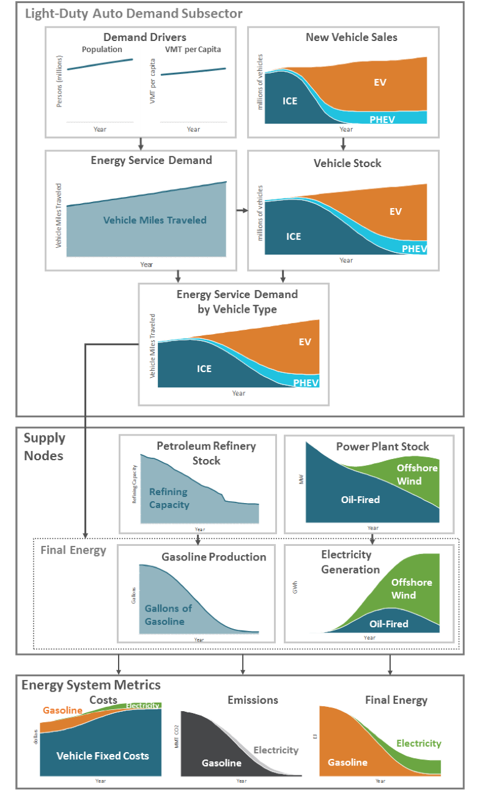
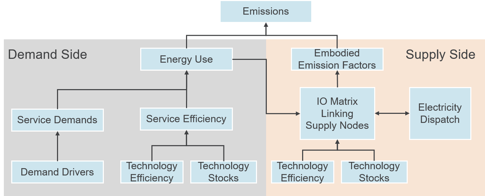

====================
Methodology overview
====================

Calculating Cost and Emissions for an Example System
====================================================

This section walks through a simple case from beginning to end to illustrate how EnergyPATWHAYS determines costs, emissions and energy for an energy system. Links are given to the sections addressing each concept in more detail.

In the figure below, the top left graph shows the demand drivers population and vehicle miles traveled (VMT) per capita across a long stretch of years. The base demand driver here would likely be population since it is common to find exogenous population projections across many geographies. With a long-term forecast for population and historical data on VMTs, VMTs per capita are projected for future years to create the second driver.

Following the arrow and multiplying population by VMT per capita gives us our total service demand for the vehicles, which is our first intermediate output. Often this type of assumption, which is clearly critical for eventually projecting energy use for our subsector, is not explicitly calculated or not typically presented, hampering comparisons between carbon emissions trajectories.

Starting at the Energy Service Demand box, the arrow to the right takes us to vehicle stock, with several intermediate steps happening behind the scenes. One reasonable question is “how do we know the total number of vehicles in future years, let alone composition?” In this example we have explicitly decided that the total number of vehicles is dependent on service demand (in modeling speak we might say that our stock is service demand dependent). In practical terms, this means that service demand becomes a driver for a projection of total vehicle fleet size. If, for example, we assume that annual VMT per vehicle remains constant, simple multiplication between this value and the energy service demand will give us total vehicle stock. Conversely, we could could have set up the model so that the service demand in VMT was dependent on the total stock instead. In this case we would have started from demand drivers that might have included population and per capita vehicle ownership and we would project the total future number of vehicles first. Notice that these two approaches are very different with regard to the conceptual framing of what drives energy demand in a subsector and could result in very different outputs, depending on the underlying data.

Once we have total stock projected over time we are ready to run a stock rollover where we determine the vehicle composition over time. While the actual dynamics can be complex, the basic idea is simple, which is that as a user, we have explicitly chosen the sales shares of internal combustion engines (ICE), electric vehicles (EV), and plug-in hybrid electric vehicles (PHEV). When vehicles from the existing stock retire over time as a function of their technology defined lifetimes, they get replaced in portion to their respective sales shares. These new sales, shown in the upper right graph result in the ultimate stock composition pictured below. Close observation will show a noticeable lag between when the sales shares by technology and the makeup of the overall fleet. This is indicative of the infrastructure inertia encountered in the energy system as is a function of the lifetimes of existing equipment.

Once we have Energy Service Demand as well as Total Stock by technology, we can allocate service demand to the individual technologies, shown in the next graph down. On the surface, this allocation could be as simple as assuming that each car in the fleet drives the same number of miles per year; however, in practice a more complex allocation can be made with the right inputs, such as the fact that new vehicles are driven more than older vehicles or the fact that some technologies satisfy a larger or smaller proportional share of service demand.

With service demand allocated to technology we can use the technology efficiency, in this case miles-per-gallon gasoline equivalent, to arrive at final energy for gasoline and electricity. This is pictured twice in the diagram, once in the dotted box and again in the lower right corner as one of the three key Energy System Metrics. Notice at the bottom figure when gasoline and electricity are put on the same axis, the overall consumed energy is dropping precipitously, despite the fact that service demand is increasing through the same period. This is due to the inherent efficiency gains from switching to an electric drivetrain.

When we have energy demand, we are ready to move to the supply side [#price_response]_ of the model to figure out how each energy demand will be met. In an actual economy wide model, we would typically have dozens of demand subsectors, energy types (e.g. diesel, kerosene, wood biomass, electricity, etc.) and supply nodes involved in meeting demand. In this example we have petroleum refineries that are used to meet gasoline demand and oil and wind power plants that meet electricity demand, both of which are controlled within a stock rollover.

Electricity dispatch happens in a separate supply step, not explicitly shown, that both calculates how much fuel of different types is used and also whether additional capacity is needed for reliability. Knowing the emissions coefficients from electricity and how much gasoline is combusted on the demand side, we are able to calculate total emissions for this example, shown in the bottom middle. Finally, costs from the supply side are allocated among energy types and within demand sectors and become additive with fixed costs on the demand side. Note that the gasoline and electricity costs will include the capital equipment costs in addition to all operational costs allocated using the input-output supply framework.

   Model flow

   Emissions calculation flow chart

.. rubric:: Footnotes

.. [#price_response] Note that when the demand side is finished calculating, we have both energy demand and technology stocks (and therefore capital cost) for every modeled year before the supply side even starts calculating. Thus, even structurally, price responsiveness within demand sectors isn’t possible, both in terms of demand elasticity and technology adoption choices. This was an explicit choice on the part of the model designers discussed further in the section on exploration versus optimization. Demand elasticity, on the other hand, is highly uncertain and in most cases only has second order impacts. We feel it is better to deal with these as explicit adjustments to service demand, which is possible through the use of service demand packages.

