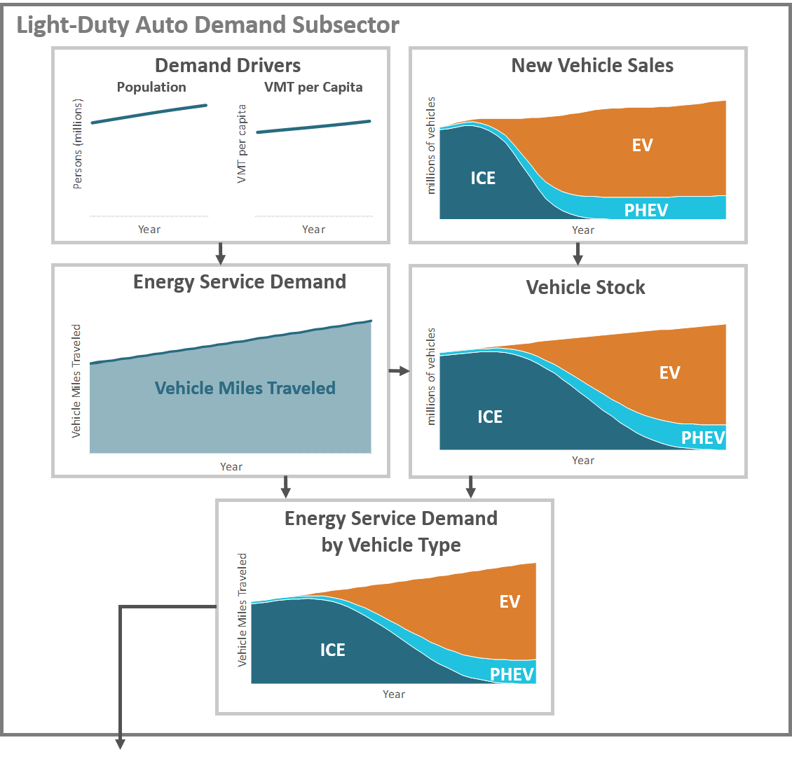
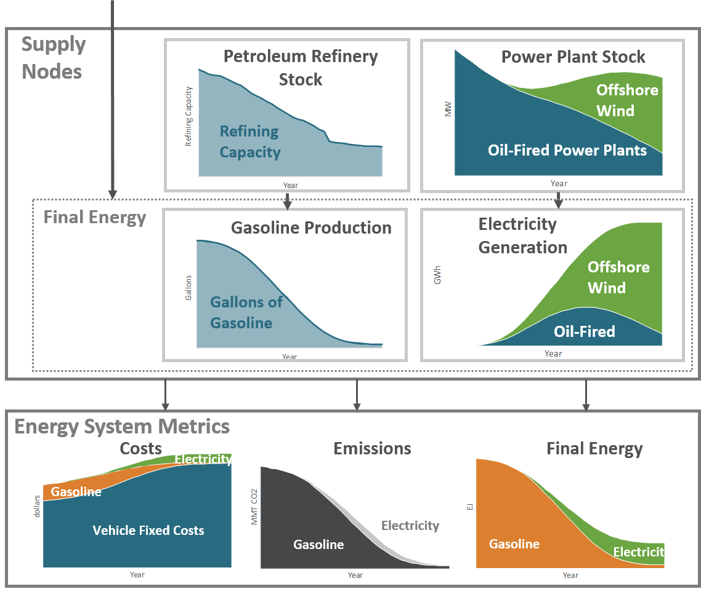
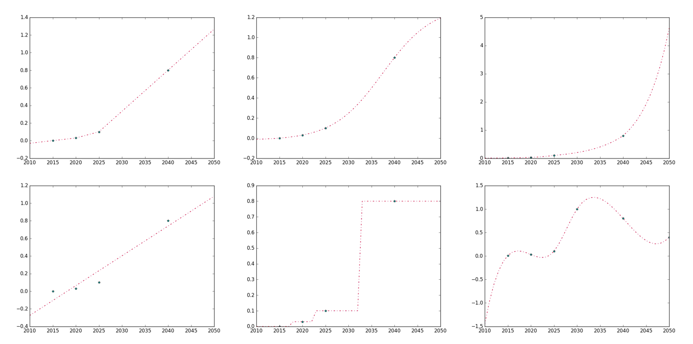
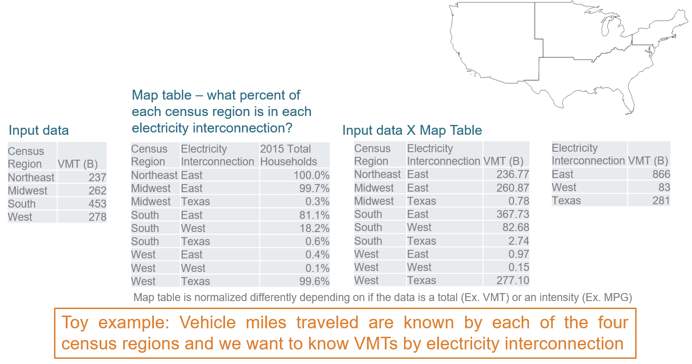

====================
Model Methodology
====================

Methodology overview
====================

EnergyPATHWAYS is a bottom-up energy sector model with stock-level accounting of all consuming, producing, delivering, and converting energy infrastructure. The flow diagram at end end of this section is used to illustrate components employed to calculate emissions from the energy system. Many of the model outputs described elsewhere in the documentation, such as annual sales by technology, are intermediate outputs of the calculation shown below.

EnergyPATHWAYS was specifically built to investigate energy system transformations, and to this end, the model leaves most energy system decisions to the user, discussed more in the section on exploration versus optimization. Thus, it is appropriate to think of EnergyPATHWAYS as a complex accounting system or simulation model that keeps track of and determines the implications of detailed user decisions. Each intervention by the user on the energy system is referred to as a measure and the calculation of the model with no measures the *base case*. Different types of measures and how each can be used is discussed in the section called *creating cases*.

Broadly speaking, EnergyPATHWAYS can be divided into a demand side and supply side, the former calculating energy demanded (E.g. kWh electricity and MMBtu natural gas) by different services (E.g. cold beer and hot showers), the later determining how each energy demand is met (E.g. natural gas extraction, power plants, transmission wires, and gas pipelines). Operationally this distinction is important in the model because the demand and supply sides are calculated in sequence.

Beginning on the demand side, the model starts with a set of inputs we call demand drivers. These are variables such as population or the value of industrial shipments and can be thought of as the skeleton upon which the rest of the model calculations depend. Ideally demand driver projections for future years are given, but if only historical data is available, EnergyPATHWAYS will use different regression techniques to project each variable across all model years. More information on this can be found in the section *projecting data for future years*.

Demand drivers are the basis for forecasting future demand for energy services. For example, if calculating the weight of laundry washed in residential households annually, a 10% increase in the demand driver, number of households, will result in a similar increase in the service demand, weight of laundry. Along with service demand, technology stocks that satisfy each service demand are tracked and projected into the future. The composition of the stock along with the efficiency of each stock type for providing services is referred to as the service efficiency, fuel economy being a classic example. Total energy demand can be calculated by dividing service demand by service efficiency across and summing across each service demand category, referred to in the model as demand subsectors. The demanded energy will be in one of many different fuel types (E.g. electricity or natural gas) depending on the technologies deployed and will be specific to a geography, customer category, and even time slice, as is the case with electricity.

Once energy use is calculated, the supply-side calculations of the EnergyPATHWAYS model begin. Mathematically supply side calculations are done with an energy input output matrix that connects the flows of energy between supply nodes that produce or deliver energy. Input-output tables are frequently used by economists and in life-cycle assessment (LCA) work, and fundamentally calculations in EnergyPATHWAYS are no different, though with several special twists.

First, the supply-side of the EnergyPATHWAYS model proceeds one year at a time and the coefficients in the input-output matrix are updated annually as the stocks in each supply node change. These coefficients give the amount of input energy from all other nodes to produce one unit of output energy from a single node. For example, if transmission and distribution losses are 6%, one unit of electrical energy supplied to a customer requires the input of 1.064 units of energy at the generator bus. If we reduce the losses to 5% over time, the coefficient in the input-output table changes from 1.064 to 1.053.

Second, in each calculation year, a detailed electricity dispatch, shown in the box to the far right, is used to inform how much of each supply node goes into producing one unit of electricity (Ex. how much coal vs. gas) and how much new generation, transmission, and distribution capacity is needed for a reliable system. The inputs for electricity dispatch are derived from the rest of the supply side (Ex. heat rates of different power plants) and from the demand-side where hourly 8760 electricity profiles are built bottom up. This capability sets EnergyPATHWAYS apart and allows for the capture of important second order effects, such as the impact of electrification on the electricity system. The electricity dispatch includes the ability to model long and short duration energy storage, thermal resources, hydroelectric plants, renewable resources, must-run generation, transmission, flexible load, and electric fuel production, such as hydrogen from electrolysis.

With the updated coefficients from the electricity dispatch and change in supply technology stocks, emissions factors from each fuel type by location are calculated and combined with final energy demand to estimate emissions for future years.

   **Model Flow Diagram**

.. figure::  images/emissions_calculation_flow.png
   :align: center
   
Example calculation
===================

This section walks through a simple example from beginning to end to illustrate how EnergyPATHWAYS determines costs, emissions and energy for an energy system.

In the figure below, the top left graph shows the demand drivers population and vehicle miles traveled (VMT) per capita across a long stretch of years. The base demand driver here would likely be population since it is common to find exogenous population projections across many geographies. With a long-term forecast for population and historical data on VMTs, VMTs per capita are projected for future years to create the second driver.

   **Demand Side Light Duty Auto Example**

Following the arrow and multiplying population by VMT per capita gives us total service demand for the vehicles, which is the first intermediate output. Often this type of assumption, which is clearly critical for eventually projecting energy use, is not explicitly calculated, hampering comparisons between carbon emissions trajectories.

Starting at the Energy Service Demand box, the arrow to the right takes us to vehicle stock, with several intermediate steps not shown. One reasonable question is, how do does one know the total number of vehicles in future years, let alone composition? In this example the total number of vehicles is dependent on service demand, which in practical terms means that service demand becomes a driver for a projection of total vehicle fleet size. If, for example, it is assumed that annual VMT per vehicle remains constant, dividing total annual VMTs by average annual VMT per vehicle will give us an estimate for the total vehicle stock. Conversely, the model could have been set up so that the service demand in VMT was dependent on the total stock instead. In this case, calculations would have started from demand drivers that might have included population and per capita vehicle ownership and the number of future vehicles would have been projected first. Notice that these two approaches result in different conceptual framing as to what drives energy demand in a subsector and could result in very different outputs, depending on the underlying data.

Once total stock is projected, the stock rollover can be run to determine the vehicle composition over time. Users of the EnergyPATHWAYS model make explicit decisions on the share of sales between internal combustion engines (ICE), electric vehicles (EV), and plug-in hybrid electric vehicles (PHEV) over time. When vehicles from the existing stock retire after reaching the end of their service lifetime, each is replaced in portion to their respective sales shares. These new sales, shown in the upper right graph result in the stock composition pictured. Close observation will show a noticeable lag between when the sales shares by technology and the makeup of the overall fleet. This is indicative of the infrastructure inertia encountered in the energy system and is a critical dynamic in understanding how such a system evolves.

Once Energy Service Demand and Total Stock by technology is calculated, service demand is allocated to the individual technologies, shown in the next box down. On the surface, this allocation could be as simple as assuming that each car in the fleet drives the same number of miles per year; however, in practice a more complex allocation can be made with the right inputs, such as the fact that new vehicles are driven more than older vehicles or the fact that some technologies satisfy a larger or smaller proportional share of service demand.

With service demand allocated, technology service efficiency, in this case miles-per-gallon gasoline equivalent, is used to arrive at final energy for gasoline and electricity. This is pictured twice in the figure below, once in the dotted box and again in the lower right corner as one of the three key Energy System Metrics. Notice in the bottom figure when gasoline and electricity are stacked, total energy consumption falls precipitously over time despite the fact that service demand is increasing through the same period. This is due to the inherent efficiency gains from switching to an electric drivetrain.

   **Supply Side Light Duty Auto Example**

The supply-side of the EnergyPATHWAYS model determines how the energy demand calculated above will be met. A full economy wide model would typically have dozens of demand subsectors, energy types (e.g. diesel, kerosene, wood biomass, electricity), and different supply nodes. This example illustrates the concepts using two supply nodes, refineries and the power sector that supply petroleum and electricity respectively. Our power sector has only two technology types, oil power plants that take petroleum as an input and wind power. The size of the refinery and power sector nodes is a function of the energy flowing through. For example, increasing demand for electricity results in growth in the power sector. Conversely, shrinking demand for petroleum means that replacement does now follow retirement and the overall capacity of the node shrinks. Notice again the important role that technology lifetime plays in the energy system. If energy throughput decreases faster than stock can be retired, the utilization of the remaining stock drops, which will impact per unit energy costs.

Just as the user chose the proportion of vehicle sales between internal combustion engines and electric alternatives, the user also makes a choice about the percentage of electrical energy supplied by wind over time [#price_response]_. Given full control over energy system investment decisions, the user has no guarantee that choices will lead to efficient and cost effective delivery of energy services. In the power system, however, user decisions are moderated to ensure a reliable electricity system. An hourly 8760 dispatch, not pictured, ensures both that sufficient dispatchable capacity is built and utilized to meet load in every hour.

In the electricity dispatch generators are dispatched based on lowest cost, subject to constraints. The variable cost of each generator is calculated in each year as the energy system evolves over time. Thus, in this example, lower refinery throughput may result in higher per unit energy petroleum cost and displacement in the dispatch by a lower cost fuel type. 

The dispatch returns petroleum use in supplying electricity and when combined with combusted petroleum on the demand side, total emissions are calculated, shown in the bottom middle box. Finally, costs from the supply side are allocated among energy types and become additive with fixed costs on the demand side. The gasoline and electricity costs will include the capital equipment costs in addition to all operational costs.

.. rubric:: Footnotes

.. [#price_response] Note that when the demand side is finished, both energy demand and technology stocks (and therefore capital cost) for every modeled year has been calculated before the supply side even starts calculating. Thus, even structurally, price responsiveness within demand sectors isn’t possible, both in terms of demand elasticity and technology adoption choices. This was an explicit choice on the part of the model designers discussed further in the section on exploration versus optimization.

Demand Methodology
==================
In the methodology overview section we frequently reference subsectors, which are the basic organizing units on the demand side.

Demand drivers
--------------
Demand driver are the natural place to start a discussion of the demand side because they are both simple in concept and form the basis for forecasting future energy demand.

Subsector types
---------------

- **Stock and Energy**
- **Stock and Service**
- **Service and Energy**
- **Service and Efficiency**
- **Energy**

Linking subsectors
------------------

Supply Methodology
==================

Calculation Steps
-----------------

Input-output calculations
-------------------------

Inputs reconciliation
---------------------

Electricity dispatch
--------------------

The electricity dispatch is used to update coefficients in the input output matrix that solves for embodied energy, emissions, & costs. These coefficients tell us, for example, how much gas is burned per unit of electricity consumed. As we change the mix of resources on our system (add renewables, storage, nuclear, CCS, add a carbon price, etc.) we impact the electricity dispatch, which gets reflected appropriately in the input output matrix.

The other way that the electricity dispatch interacts with the rest of the model is in determining the need for new capacity to meet electricity reliability. We have a stock rollover that controls the mix of the fleet based on plant vintage and technology lifetime. If our electricity system has insufficient capacity, this signal is sent to the stock rollover where additional capacity is built. The same goes for transmission and distribution capacity.

Types of Nodes
--------------

- **Blend:** Blend nodes control the relative throughput of supply-nodes to other supply-nodes. They are non-physical nodes -- i.e. you can’t go and look at a blend node. Our Pipeline Gas Blend node, for example, controls the share of natural gas, biogas, hydrogen, and synthetic methane into  the Gas Transmission Pipeline. 
- **Conversion:** Conversion nodes convert energy products from one form to another. Gas combined-cycle steam turbines are an example of a conversion node. 
- **Delivery:** Delivery nodes transfer energy products but don’t change the composition of the product itself. Gas transmission pipeline are an example of a delivery node. 
- **Product:** Product nodes are used to specify the emissions and costs of energy at a specific point in the IO framework. This is used for products where we can’t or don’t want calculate these values endogenously in the analysis. As an example, we specify the cost and emissions intensity of many refined oil products because calculating these endogenously requires a more sophisticated representation of the petroleum refining sector. 
- **Primary:** Primary Nodes are the source of primary energy to an energy system. Can be represented as pure accounting nodes (i.e. Solar Primary Energy) or as supply curves with constraints, resource costs, etc. (i.e. Biomass Primary Energy)
- **Storage:** Storage nodes are nodes that store electric energy. They aren’t demanded as an energy product from the IO framework and so must be specified in terms of power (discharge capacity) and energy (storage energy).  They are used in the electricity dispatch optimization. Examples include distributed and bulk battery storage as well as pumped-hydro storage.

Allocation of Costs and Emissions
---------------------------------

Creating Cases
==============

Cases are a combination of packages that change the baseline projected energy system. The base model can be run in the absence of any change case measures and functions like a “straight-line” projection of the energy system moving forward. It can contain some base expected changes, but it doesn’t have any specific packages applied to it. A change case takes the base model and applies packages to it -- for example, a light-duty vehicle electrification package would change the stock composition in light-duty vehicles and thus change the outcomes of the entire energy system.

For a full discussion of creating cases, see the User Guide.

Additional Model Components
===========================

Stock rollover
--------------

Projecting data for future years
--------------------------------
This simple example using the demand drivers population and number of households illustrates an important concept in EnergyPATHWAYS, which is how demand-side data is projected into future years. This same concept is used the project the future stock size and service demand of different demand subsectors.

   **Methods used to interpolate and extrapolate data across model years**

Electricity load shapes
-----------------------

Trading Between Geographies
---------------------------

Handling data on different geographies
--------------------------------------

   **Example of how data is converted between geographies**

Custom modeling indices
-----------------------

Financial Calculations
----------------------
