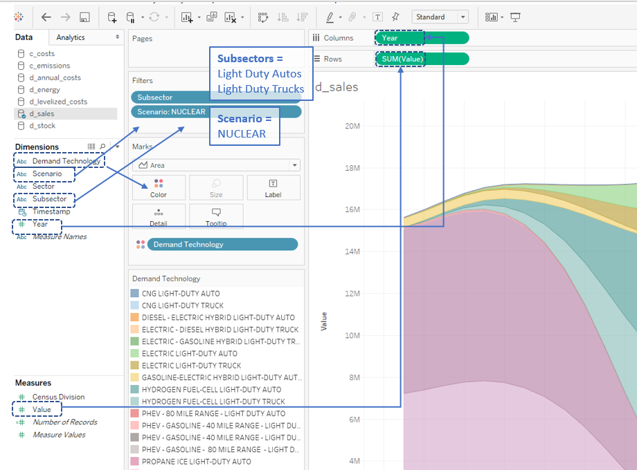
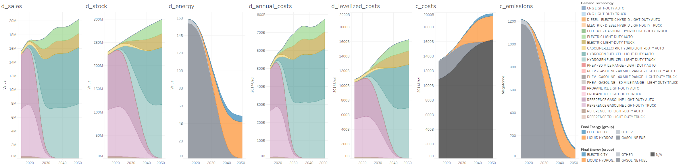
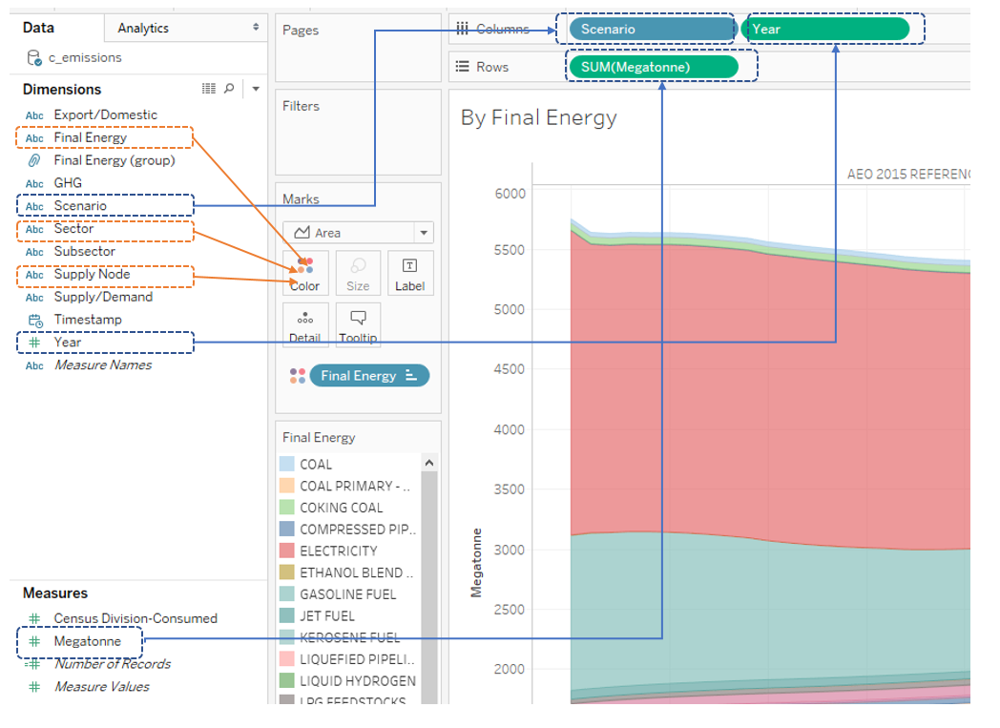
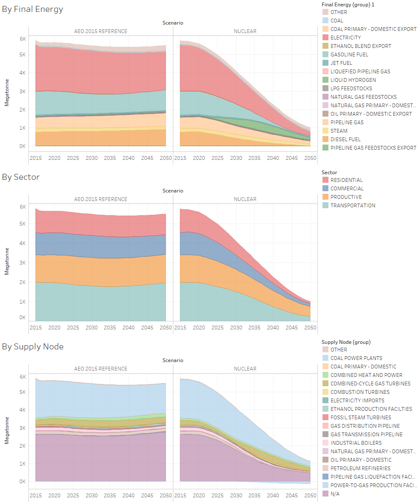

=======
Outputs
=======

This section describes the outputs produced from an EnergyPATHWAYS model run. Each CSV file is stored in one of four folders that separates outputs to:

- Demand-side (“demand_outputs”);
- Supply-side (“supply_outputs”);
- An amalgamation of the demand- and supply-sides (“combined_outputs”); and
- Hourly electricity dispatch results (“dispatch_outputs”).

The CSV output file descriptions below are organized along these four folders.

General Terminology
===================

In addition to indices specific to each file, the following includes a list and description of common indices:

Primary Geography (Ex. Census division for U.S. model run)
  Census division is  consistent with the EIA’s National Energy Modeling System (NEMS). Map available here: https://www2.census.gov/geo/pdfs/maps-data/maps/reference/us_regdiv.pdf

Sector
  Demand sectors that include residential, commercial, transportation, and productive (industrial and agricultural sectors excluding those that are part of the energy supply chain, Ex. refining)

Subsector
  More detailed units of demand analysis. Associated with unique energy service demands. Ex. residential water heating.

Supply node
  Upstream energy supply sectors associated with the production, conversion, delivery, or storage of energy.

Final Energy
  An energy type consumed to satisfy energy service demand. Differentiated from upstream energy use that is consumed to produce final energy.

Scenario
  Scenario name (Mixed, High CCS, etc.)

Year
  Corresponding year of outputs.
  
Timestamp
  Time of scenario run

Demand-Side Outputs
===================

d_annual_costs.csv
------------------

Annual spending on demand-side equipment (water heaters, vehicles, etc.) and efficiency measures. These costs are not levelized and represent actual needed outlays in each year.

d_driver.csv
------------

Underlying drivers of demand stock and service demand projections (ex., households; heating degree days). 

d_energy.csv
------------

Final energy demand by technology and final energy type (ex., pipeline gas consumed by a residential natural gas furnace).

d_levelized_costs.csv
---------------------

Demand-side equipment capital costs which are translated into annualized costs.

d_sales.csv
-----------

Quantity of demand-side equipment purchased each year by technology (ex., number of electric vehicles sold in each year)

d_service_demand.csv
--------------------

Projections of energy service demands by demand sub-sector (ex., vehicle miles traveled; lumen-hours; etc.)

d_stock.csv
-----------

Quantity of demand-side equipment stocks by technology (ex., electric vehicles; water heaters).

Index Descriptions:
- Unit: unit of demand technology stock. For example, the unit for commercial water heaters is kiloBTU capacity. 

Supply-Side Outputs
===================

s_annual_costs.csv
------------------

Annual (not levelized) spending on fuels (ex., gasoline), infrastructure (ex., distribution grid), and supply technology costs including capital costs, fixed operations and maintenance (O&M) costs, and variable O&M costs.  Represents supply-node spending independent of whether the final energy product is eventually exported.

s_capacity_utilization.csv
--------------------------

Annual utilization of supply nodes (i.e., actual annual production divided by potential annual production).

s_curtailment.csv
-----------------

Quantity of electric generation that is curtailed in each year.

s_energy.csv
------------

Embodied (upstream) energy flow through each supply node. 

s_io.csv
--------

Input-output matrix used to calculate embodied energy, emissions and costs. For example, a coefficient in the matrix contains the amount of pipeline gas required for each unit of electricity consumption. 

s_levelized_costs.csv
---------------------

Supply technology capital costs which are translated into annualized costs.

s_stock.csv
-----------

Quantity of supply-side equipment stocks by technology (ex., wind power plants; industrial pipeline gas boiler).

Index Descriptions:
- Vintage: year in which the supply resource comes online.

Combined Outputs
===================

c_costs.csv
-----------

Energy system costs, including fuel expenditures, levelized costs for both demand- and supply-side equipment, and operations and maintenance costs.

Index Descriptions:
- Export/Domestic: “Exports” includes costs associated with energy that is produced for consumption elsewhere and “Domestic” includes costs associated with energy that is consumed in the US.  To calculate scenario net costs, the Domestic filter should be applied, as these are costs borne by US consumers.

c_emissions.csv
---------------

Full cross-section of all energy CO2 emissions in the US economy. Emissions can be represented by either source (ex., coal power plants), final energy (ex., electricity) or both simultaneously.

Index Descriptions:
- Primary Geography Consumed: geography where produced emissions are allocated as a function of energy demand. For example, electricity generated in coal plants in the Mountain Census division may be attributed to the Pacific Census division if that electricity is consumed there.
- Export/Domestic: Emissions associated with energy that is produced for consumption elsewhere (Export) or emissions associated with energy that is produced and consumed in the US (Domestic).
- GHG: Greenhouse gas identifier. Only energy CO2 is included.
- Supply/Demand: Differentiates between emissions generated in the upstream production of final energy (supply) and emissions generated by direct combustion of final energy (demand).  “Supply” would refer to emissions generated in a power plant and “Demand” would refer to emissions generated by a gas water heater.

Additional Notes:
- Negative emissions are shown for biomass supply nodes to represent sequestration. Positive emissions from ultimate consumption of biofuels are recorded separately at the location of their consumption.

c_energy.csv
------------

Full cross-section of all energy in the US economy. Energy can be represented by either final energy consumption, or all upstream energy needed to satisfy final energy demand.

Index Descriptions:
- Energy Accounting: Refers to the method of accounting for energy flows. “Embodied” represents all upstream energy flows associated with final energy consumption. For example, electricity would include flows through the coal primary supply node, coal power plant supply node, and electricity distribution grid supply node.  “Final” refers to final energy consumption by final energy type, sector, and subsector. 
- Primary Geography: location of the flow or consumption of energy depending on the energy accounting type selected.

Dispatch Outputs
===================

hourly_dispatch_results.csv
---------------------------

Hourly generation and load by dispatch geography.

Index Descriptions:
- Dispatch Output: sources of generation and load. For example, includes transmission-sited solar PV and offshore wind on the generation-side, and commercial sector and hydrogen electrolysis load. 
- Weather Datetime: hourly timestamp for outputs. 
- Dispatch geography: selected geography for model dispatch. For example, the U.S. model may use three interconnections (i.e., Eastern Interconnection, Western Interconnection and ERCOT).
 
Additional Notes:
- Generation dispatch outputs are negative values and load dispatch outputs are positive values.

Tableau Examples
================
Many of the raw model output files are large (i.e., exceeding 1 GB), making them difficult to view and manipulate in a program such as Excel. Tableau or similar software provides easy data visualization and extraction of relevant data. To demonstrate how to process the raw outputs and understand the results, we provide instructions on how to develop standard results using Tableau. The examples below are not exhaustive and instead illustrate some of the model’s capabilities.

Both examples reference tableau packaged workbooks found in the EnergyPATHWAYS github repository under ``energyPATHWAYS\model building tools\tableau examples``

Light-Duty Vehicles Example
---------------------------

Assess the impact of hydrogen fuel cell and electric vehicles on costs, energy and emissions (note: outputs are from the High Nuclear Case)

Output files used: ``d_sales, d_stock, d_energy, d_annual_costs, d_levelized_costs, c_costs, c_emissions``

The figure below shows how the d_sales file is processed in Tableau to show annual sales of light-duty vehicles by technology and year for the High Nuclear Case. The remaining demand output are filtered in the same way, while the combined output files (i.e., c_costs and c_emissions) show results by final energy type rather than demand technology.

   d_sales.csv in Tableau

Each CSV file is stored on a separate worksheet and then combined onto a single dashboard in Tableau, as shown below. From left to right:

- d_sales: sales of hydrogen fuel cell and electric vehicles increase over time
- d_stock: total LDV stock composition takes time to reflect vehicle sales
- d_energy: final energy demand substantially decreases; gasoline is eliminated, while H2 and electricity constitute all demand by 2050
- d_annual_costs: annual spending on new LDVs peaks in 2035
- d_levelized_costs: annualized cost of vehicles increases by 60% between 2015 and 2050
- c_costs: annualized costs for the entire light-duty vehicle sub-sector shift from expenditures on gasoline to H2 and electricity. Note that the black portion (“N/A”) is equivalent to the levelized cost of demand-side equipment (i.e., vehicles), whereas the remaining levelized costs are related to supply-side. 
- c_emissions: LDV emissions fall below 100 million metric tons CO2 by 2050, as gasoline consumption decreases and the carbon intensity of electricity generation and hydrogen production falls.

   LDV Transition, High Nuclear Case

Light-Duty Vehicles Example
---------------------------

Compare U.S. economy-wide, energy-related CO2 emissions between Reference Case and High Nuclear Case across multiple perspectives

Output files used: ``c_emissions``

The figure below shows how to calculate annual emissions by scenario and year along three different dimensions: (a) final energy type; (b) end-use sector; and (c) supply node.

   c_emissions.csv in Tableau

The summary of emissions results is shown below.

   
   Energy-related CO2 emissions, Reference and Nuclear Cases
