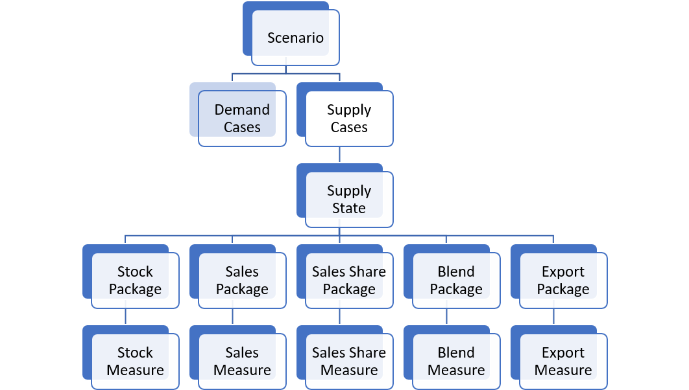

====================
User Guide
====================

Measures & Scenarios
====================

EnergyPATHWAYS operates at its simplest on the level of measures and scenarios. Scenarios are an aggregation of measures, defined here as actions undertaken to change the energy system from a business-as-usual projection. We use other levels of aggregation of measures in order to organize these measures into scenarios and to facilitate repurposing groups of measures. These levels are called “packages” and “states”. Packages are groups of measures of the same type. States are groups of packages of different types.

On the demand-side, we employ the following six types of measures:

- **Sales Measures:** These measures change the deployment of technologies using the concept of sales shares. If we wanted to change the penetration of electric vehicles (EVs) into the market, we could develop a measure that creates any level of adoption we want.  These measures can be used in any subsectors with technology-level stock representation.
- **Stock Measures:** These measure also change the deployment of technologies using the concept of stock instead of sales. While equipment sales are the equipment put into service in a specific year and thus of a certain vintage, equipment stock are all stocks that are operating in a certain year of a variety of vintages. If we want to say that the sum of all EVs on the road in 2030 will equal 1.5 million, we would do so with a stock measure. These measures can be used in any subsectors with technology-level stock representation.
- **Service Demand Measures:** These measures alter the projection of service demand in a demand subsector. For example, if we projected a 25% decline in vehicle miles traveled due to land-use and ridesharing policies, we could enter that as a measure here. 
- **Energy Efficiency Measures:** Energy efficiency measures are used in demand subsectors where we do not have technology and stock-level representation of end-use equipment.  We can change the trajectory of energy demand, however, by implementing generic energy efficiency measures that can achieve energy reductions at a specified cost. 
- **Fuel-Switching Measures:** Fuel switching measures are also used in demand subsectors without technology-level representations. We can implement these measures to change the composition of final energy demand. For example, if we wanted to change the final energy type in process heating from pipeline gas to electricity, we could do so with a fuel – switching measure. 
- **Flexible Load Measures:** Flexible load measures define the amount of electric load in a subsector that we anticipate can be moved in time. For example, if we wanted 25% of residential electric water heating to be dynamically used to reduce peak loads and facilitate renewable integration, we could achieve that with a flexible load measure.

   Model Scenario Architecture - Demand

.. figure::  images/demand_scenario_architecture.png
   :align: center

On the supply-side we have five different types of measures:

- **Sales Share Measures:** These measures control the sales share of technologies within a supply-node. For example, if we wanted to have 50% of photovoltaic deployment be fixed-tilt and 50% tracking, we would use a sales share measure. 
- **Sales Measures:** These control the overall level of sales within a node. For example, if we wanted to install 1 GW of fixed-tilt PV in 2030, we would use a sales measure. 
- **Stock Measures:** These measures control the overall level of technology deployment by year. If we wanted to project an overall level of wind deployment by year out to 2050, we would use a stock measure. 
- **Blend Measures:** These measures are used to control the behavior of blend nodes in the model. Blend nodes control flows through the IO matrix by changing the relative proportions of downstream demand that are serviced with different supply nodes. For example, the default for hydrogen production is natural gas steam reformation. If instead I wanted the hydrogen demanded in my energy system to come from 50% steam reformation and 50% electrolysis, I would use a blend measure to define those blending components. These are also used to define things like biofuel percentages in diesel or gasoline. 
- **Export Measures:** Energy systems don’t necessarily just operate to satisfy internal energy service demand. Oftentimes the activity of the energy system is related to external demands for energy products. For example, oil & gas extraction may be related to export opportunities. These measures are used to change these export amounts.

   Model Scenario Architecture - Supply

These measures are aggregated into packages of like-types, so, while we would use a measure to define the sales penetrations of heat pumps, we may combine that with sales penetrations of electric resistance heaters and electric boilers to create an electrification sales package. This could then be combined with a package of unlike-type, say, with a flexible load package to create a demand state for residential space heating that represents a residential space heating subsector with large amounts of flexible electricity.

Running Sensitivities
=====================

Demand Sensitivities
--------------------

Demand-side sensitivities can be important to understand the relative impact of technology deployment to the success (however defined) of a developed pathway. This can be a key tool in developing robustness analysis as many projections of technology development are uncertain. It can also demonstrate conditions under which demand technologies may be cost-effectively deployed and can be a key tool in competitiveness analysis.

For example, while deployment of certain technologies today may not be economic, a variety of changing conditions including those on the grid (high penetrations of renewables and the ability of flexible loads to participate) may change that equation. The ability to model technologies and anticipate their behavior on the system and economics in a variety of scenarios is one of the primary strengths of the EnergyPATHWAYS approach.

Add new demand technology definition or change demand technology parameters
^^^^^^^^^^^^^^^^^^^^^^^^^^^^^^^^^^^^^^^^^^^^^^^^^^^^^^^^^^^^^^^^^^^^^^^^^^^

This is a user decision as to whether they would like to add an entire new technology definition or would like to simply alter the parameters of one technology. For quick, one-off analyses of the importance of different technology parameters, it may make sense to simply alter a technology definition (i.e. change its capital costs) and run a case to compare the overall impact of such a technology change. When a user is interested in a wholly new technology that may behave differently than a previously input technology or differ substantively along a variety of potential definitions, then it may make more sense to input a new technology. We will walk through the steps to input a new technology understanding that the only difference for amending a technology is to edit an existing record instead of entering an entirely new one.

1. Add a new technology to the **DemandTechs** table. This will include general parameters like lifetime, associated demand subsector, usage shape (for electric technologies), as well as flexibility parameters (max delay or advance) to inform flexible load potential on the supply-side. For a full list of input parameters and description see:
2. Input efficiency parameters using **DemandTechsMainEfficiency**; **DemandTechsMainEfficiencyData**; **DemandTechsAuxEfficiency**; and **DemandTechsAuxEfficiencyData**; **DemandTechsParasiticEnergy**(Optional); **DemandTechsParasiticEnergyData**; These efficiency inputs can be in almost any unit combination that is consistent with the energy service demand specification. So, for example, if the service demand of light-duty vehicles is in vehicle miles traveled, then the efficiency parameters can be any permutation of distance and energy (ex. Miles/GGE, kilometer/GJ, etc.). **DemandTechsAuxEfficiency** is used for defining technologies that are dual-fuel. For example, plug-in hybrid electric vehicles have an efficiency entry for both the main energy type (electricity) and the auxiliary energy type (gasoline fuels). Parasitic energy is energy associated with the use of equipment unrelated to amount of service demand. So, for example, if there is standby electricity related to a furnace that exists regardless of heating demand, this would be parasitic energy. 
3. Input cost parameters using **DemandTechsCapitalCosts**; **DemandTechsCapitalCostNewData**; **DemandTechsInstallationCost**; **DemandTechsInstallationCostNewData**; **DemandTechsInstallationCostReplacementData**; **DemandTechsFuelSwitchCost**; **DemandTechsFuelSwitchCostData**; **DemandTechsFixedMaintenanceCost**; **DemandTechsFixedMaintenanceCostData**. These inputs allow a user to flexibly define the cost parameters of both owning, installing, and operating demand-side equipment. Capital costs can be input for both new installation (i.e. a new gas furnace in a home) vs. replacement (replacing a gas furnace with a newer vintage on burnout). Installation costs can be input similarly.   Fuel-switching costs add additional flexibility. This cost is assessed when a technology changes from one energy type to another. For example, when a light-duty vehicle goes from a gasoline vehicle to an electric one, we can input the cost of a new home charger. As another example, when a gas water heater changes to a heat pump, we can include any additional wiring costs in this input. Fixed maintenance costs are associated with the ongoing annual operations of a piece of equipment. Tires and oil changes for light-duty vehicles would be examples of O&M costs.

Changing an underlying driver to alter service demand growth
^^^^^^^^^^^^^^^^^^^^^^^^^^^^^^^^^^^^^^^^^^^^^^^^^^^^^^^^^^^^

This sensitivity is used to explore the impacts of certain underlying macroeconomic assumptions (i.e. population) that may be driving projections of energy service demand (i.e. VMTs) that eventually change projections of energy, costs, and emissions. Many service demand projections have underlying linkages with these macroeconomic factors that make these sensitivities interesting. It is important to understand model structure very intimately to ensure that the relationships a user may anticipate between service demand and macroeconomic drivers are being utilized in the database.

Changing a projection of service demand
^^^^^^^^^^^^^^^^^^^^^^^^^^^^^^^^^^^^^^^

While it may be interesting for a user to see the impact of macroeconomic projections, many times it is better to directly change a projection of energy service demand. For example, if we are interested in the effect of VMTs on emissions, it’s likely better to change the VMT projection itself than to change population projections. There are a few ways to change projections of service demand.  The best way to accomplish this is to implement a service demand measure using the **DemandServiceDemandMeasures** and **DemandServiceDemandMeasuresData** table. A service demand measure can be used to alter a trajectory of service demand in any subsector. For example, if we wanted to reduce our VMT by 10% by 2030, we could input a measure that grows the service demand impact from 0% in 2016 to 10% in 2030.

Changing demand technology deployment
^^^^^^^^^^^^^^^^^^^^^^^^^^^^^^^^^^^^^

In addition to defining different technologies, sensitivities can be conducted on different levels of technology deployment. This can be accomplished either by adding a sales share measure in the table **DemandSalesMeasures** which controls the penetration of a certain technology by vintage (i.e. 50% of light-duty vehicles sold in 2030 are EVs) or by adding a stock measure in the **DemandStockMeasures** table, which controls the overall stock of a certain technology in given years (i.e. by 2030 there are 1.5 million EVs).

Supply-Side Sensitivities
-------------------------

Supply-side sensitivities can take many forms.  Similar to technology sensitivities on the demand-side, we can alter key supply-side technology parameters like capital costs and efficiency in order to gauge the impact of future technology advances. We can also alter the trajectories of their deployment using a variety of different measure definitions.

Add new supply technology definition or change supply technology parameters
^^^^^^^^^^^^^^^^^^^^^^^^^^^^^^^^^^^^^^^^^^^^^^^^^^^^^^^^^^^^^^^^^^^^^^^^^^^

This is a user decision as to whether they would like to add an entire new technology definition or would like to simply alter the parameters of one technology. For quick, one-off analyses of the importance of different technology parameters, it may make sense to simply alter a technology definition (i.e. change its capital costs) and run a case to compare the overall impact of such a technology change. When a user is interested in a wholly new technology that may behave differently than a previously input technology or differ substantively along a variety of potential definitions, then it may make more sense to input a new technology. We will walk through the steps to input a new technology understanding that the only difference for amending a technology is to edit an existing record instead of entering an entirely new one.

1. Add a new technology to the **SupplyTechs** table. This will include general parameters like lifetime, associated supply node, usage or generation shape (for technologies that use or produce electricity).
2. Input efficiency parameters using **SupplyTechsEfficiency**; **SupplyTechsEfficiencyData**; These efficiency inputs can be in almost any unit combination of energy input/energy output. Natural gas power plants, for example, might be input using heat rates (traditionally btu/kWh).  
3. Input cost parameters using **SupplyTechsCapitalCosts**; **SupplyTechsCapitalCostNewData**; **SupplyTechsInstallationCost**; **SupplyTechsInstallationCostNewData**; **SupplyTechsInstallationCostReplacementData**; **SupplyTechsFixedMaintenanceCost**; **SupplyTechsFixedMaintenanceCostData**; **SupplyTechsVariableMaintenanceCosts**; **SupplyTechsVariableMaintenanceCostData**. Many of these inputs have parallels on the demand-side. On the supply-side we have additional variable maintenance cost inputs that are input on a per-unit of energy production basis.
4. Input other performance characteristics using **SupplyTechsCO2Capture**; **SupplyTechsCO2CaptureData**; **SupplyTechsCapacityFactor**; **SupplyTechsCapacityFactorData**. The supply-side has other unique technology characteristics that we do not find on the demand-side. CO2 capture governs the amount of combusted CO2 that sequestered as opposed to those released into the atmosphere. Capacity factor inputs are used to inform maximum potential annual energy production from a given installed capacity. For renewables and other non-dispatchable technologies, this maximum potential can be reduced by curtailment. For thermal resources (like gas power plants) achievement of this maximum is determined economically using an electricity dispatch.

Changing supply technology deployment
^^^^^^^^^^^^^^^^^^^^^^^^^^^^^^^^^^^^^

There are four different measure types that can change levels of technology deployment on the supply-side. These are broadly able to separated into measures that “push” technologies (stock measures and sales measures) and measures that “pull” technologies (blend measures and sales share measures). Stock and sales measures push technologies by placing a specified amount of technologies into service (i.e. 10,000 MW of solar PV). The model then automatically accommodates that stock by changing the grid composition downstream to accommodate that produced energy. Sales share and blend measures work by inducing a demand for a technology on the supply-side. For example, if we specify that 10% of grid electricity should come from solar PV (blend measure) the model will build solar to meet that specification. Sales share measures work within nodes to determine what technology meets that overall demand for the supply node (i.e. new GWh demand for solar PV is met with 50% fixed-tilt and 50% tracking).
